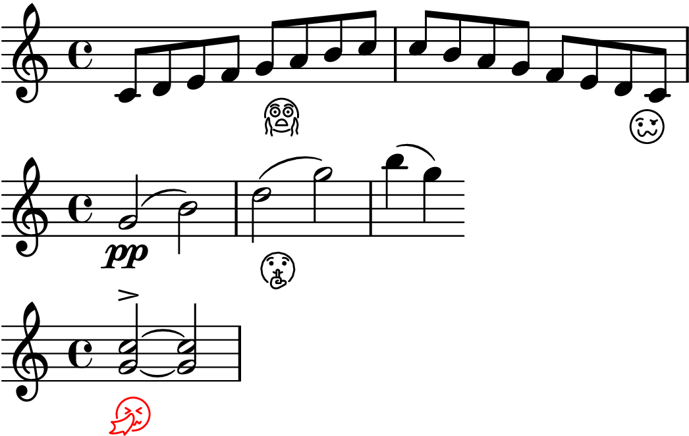
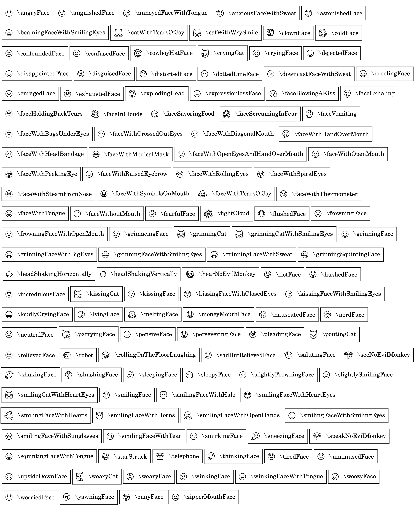

# lilypond-emoji

An emoji library for the [LilyPond](https://lilypond.org/index.html) music notation software. 
This library is generated using the [OpenMoji](https://openmoji.org) vector graphics.

- **LilyPond**: https://lilypond.org/index.html
- **OpenMoji**: https://openmoji.org/library/#group=smileys-emotion

## Example

## Emoji Sheet

## License 

The licensing of this project follows the terms of the original OpenMoji and LilyPond projects. 

Specifically, all emoji graphics are derived from the OpenMoji project and are licensed under the [Creative Commons Share Alike License 4.0 (CC BY-SA 4.0)](https://creativecommons.org/licenses/by-sa/4.0/).
